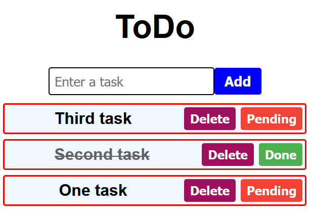

# React-MongoDB ToDo 

## Idea
This is a basic project that I decided to embark upon to explore how React works and how I enjoy it, and to brush up on 
my MongoDB skills.

Its purpose is simple: add tasks into a database, mark them as done or pending, and delete them at your own leisure.  
The appearance is what it is. I fully admit that my interests lie more in back-end development, rather than front-end. 

## Resources
I would like to thank BroCode, especially, for his React Tutorial series, which was a great starting point for picking 
up on some React concepts as I worked through different iterations and attempts.

Since I used JetBrain's WebStorm for this project, I decided to give their AI-chat and Junie a try. Both worked quite
well and helped me understand a lot of the concepts. Also, very solid documentation, I feel.

## Future Development?
Maybe. Perhaps. I might return to it and see if I can integrate some form of login/registration and user authentication.

## On React
Not too fond of it, not going to lie here.

